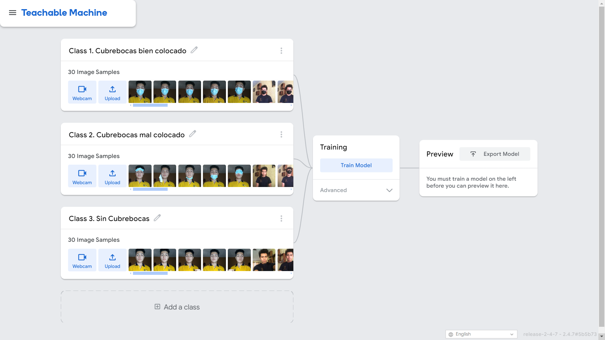
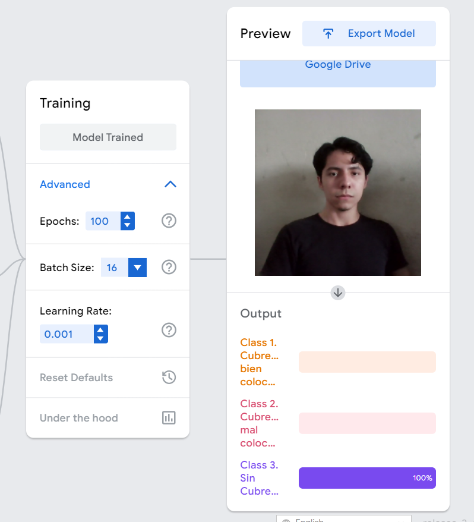
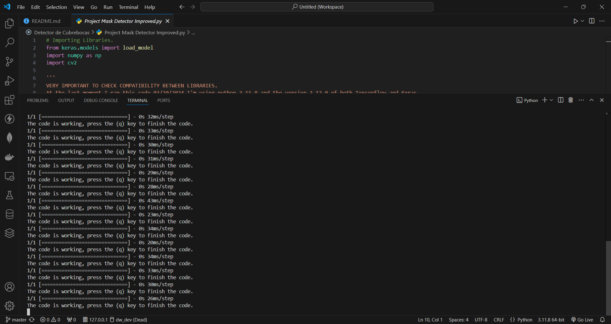
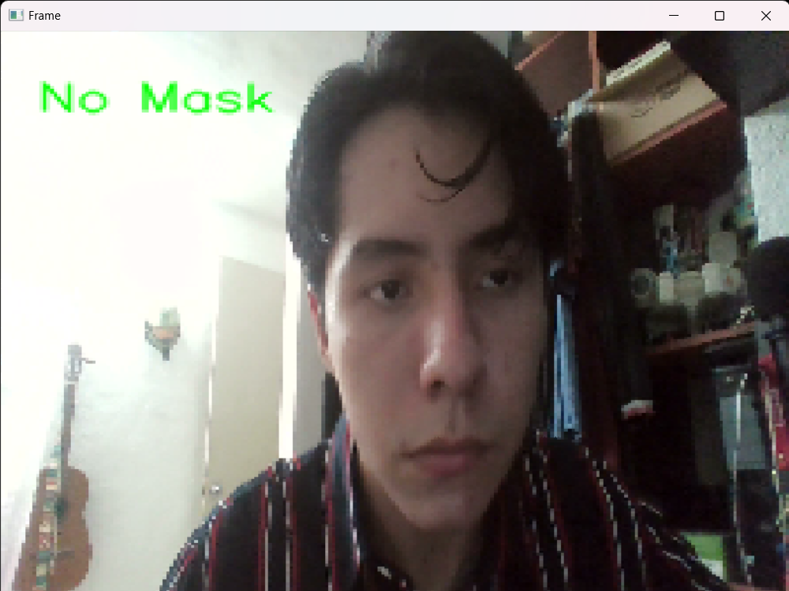
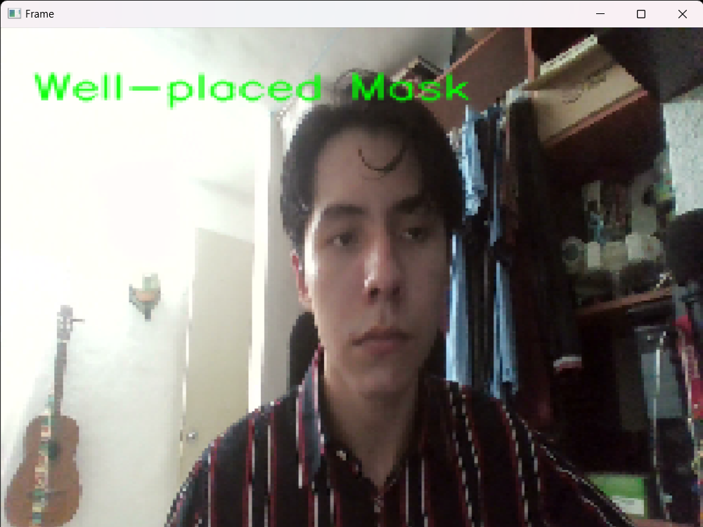

[](https://www.python.org/)
[](https://www.tensorflow.org/)
[](https://keras.io/)
[](https://opencv.org/)
[](https://numpy.org/)

# Machine Learning Face Mask Detector by using Teachable Machine

This repository preserves an old project from my preparatory/high school days, where I developed a facemask detector in Python. The project utilized Teachable Machine, a web-based tool by Google that allows users to create machine learning models by simply providing images.

In the wake of the COVID-19 pandemic, facemasks became an essential part of daily life. To address this need, I embarked on a project to create a facemask detector, which could automatically identify whether a person is wearing a facemask or not. This project not only provided a practical application but also served as an introduction to machine learning concepts and tools.

The facemask detector project demonstrated how machine learning could be applied to solve real-world problems quickly and effectively. It also served as an educational tool, helping me understand the basics of machine learning, image processing, and model deployment.

This repository stands as a testament to my early explorations into the world of machine learning and serves as a foundation for more advanced projects in the future. Whether you're a student, educator, or developer, this project showcases the potential of accessible machine learning tools like Teachable Machine to create impactful applications.

## Index

- [Content Overview](#content-overview)
- [Installation](#installation)
- [Usage](#usage)
- [How it works](#how-it-works)
- [Expectations for future](#expectations-for-future)
- [Contributions](#contributions)
- [Credits](#credits)
- [License](#license)

## Content Overview

### 1. `Project Mask Detector.py`

This is the initial Python script for the facemask detection project. It loads a pre-trained Keras model and uses OpenCV to capture video from the webcam. The script preprocesses each frame, makes predictions using the model, and displays the results in real-time with appropriate labels indicating whether a facemask is well-placed, poorly placed, or absent. The script also includes a basic loop that allows the user to terminate the program by pressing the 'q' key.

### 2. `Project Mask Detector Improved.py`

This is an improved version of the initial facemask detection script. It includes enhanced error handling for loading the model and sets the camera and display window resolution for better visualization. Additionally, the script includes more detailed and refined code for displaying the prediction results on the video frames. It maintains the core functionality of capturing video, preprocessing frames, making predictions, and displaying the results with labels.

### 3. `keras_model_Original.h5`

This file is the original Keras model trained using fewer images. It was created using Teachable Machine and saved in the H5 format. The model is used in the initial facemask detection script to make predictions on whether a person is wearing a facemask properly.

### 4. `keras_model.h5`

This file is an updated Keras model trained with more images compared to the original model. It likely has better accuracy and reliability due to the increased training data. The model is used in the improved version of the facemask detection script.

### 5. `converted_keras_2022.zip`

This ZIP file contains the Keras model files as they were downloaded in 2022. It likely includes the model's architecture and weights saved in a format compatible with Keras, which can be extracted and used in the facemask detection scripts.

### 6. `converted_keras_2024.zip`

This ZIP file contains the Keras model files as they were downloaded in 2024. Similar to the 2022 ZIP file, it includes the model's architecture and weights, possibly with updates or improvements. The files can be extracted and used in the facemask detection scripts.

## Installation

1. Clone the repository:

    ```bash
    git clone -b master git@github.com:MDavidHernandezP/MLFaceMaskDetectorTeachableMachine.git
    cd "the proyect directory"
    ```
    
    OR:

    ```bash
    git clone https://github.com/MDavidHernandezP/MLFaceMaskDetectorTeachableMachine.git
    cd "the proyect directory"
    ```

## Usage

To use the project, one needs to first ensure the necessary dependencies such as Python, `TensorFlow`, `Keras`, and `OpenCV` are installed. The user then runs either the `Project Mask Detector.py` or the `Project Mask Detector Improved.py` script. The script captures video from the webcam, processes each frame by resizing and normalizing the image, and feeds it into the pre-trained Keras model to make predictions. Based on the model's output, the script overlays a label on the video indicating the status of the facemask (well-placed, poorly placed, or no mask). The live video feed with the annotations is displayed in a window, providing real-time feedback. Users can terminate the detection process by pressing the 'q' key. This application is useful for environments where monitoring mask compliance is essential, such as schools, offices, and public venues.

## How it works

Data Collection: I gathered a dataset consisting of images of people with and without facemasks. These images were then uploaded to Teachable Machine.



Model Training: Using Teachable Machine, I trained a classification model with the uploaded images. The tool automatically handled the training process and provided a downloadable model file.



Model Integration: The trained model was integrated into a Python application. Using OpenCV, the application processed video feeds and applied the model to detect facemasks in real-time.



Real-Time Prediction: The application continuously analyzed the video feed, providing immediate feedback on whether a facemask was detected.

|  |  |
|------------------------------------|------------------------------------|
| This is how it looks like.         | But well... it's not perfect.      |


## Expectations for future

This project has not much improving to do, I made it in 2022 and I improved it in 2024, the only improvement that it can be done, it's create the Machine Learning model from scratch, using convolutional neural networks rather than just using Teachable Machine to get it, but I'm really don't thinking into do it, at least not in a near near future.

## Contributions

Any contribution is accepted for this project we align with the MIT License for open source. If you are interested in contributing directly, or just copy the code for an own project, you're completly free to do it. You can contact us by this email in case of doubts or contributions: `mdavidhernandezp@gmail.com`.

- **Steps for contributing:**
1. Fork the project.
2. Create a branch (`git checkout -b feature/new-feature`).
3. Commit your changes (`git commit -am 'adding new feature'`).
4. Push the branch (`git push origin feature/new-feature`).
5. Open a pull request.

## Credits

This project was originally created in Preparatory/Highschool for the subject Introduction to industry 4.0 by:

1. MARIO DAVID HERNÁNDEZ PANTOJA

## License

This project is licensed under the MIT License

MIT License

Copyright (c) 2024 Mario David Hernández Pantoja

Permission is hereby granted, free of charge, to any person obtaining a copy
of this software and associated documentation files (the "Software"), to deal
in the Software without restriction, including without limitation the rights
to use, copy, modify, merge, publish, distribute, sublicense, and/or sell
copies of the Software, and to permit persons to whom the Software is
furnished to do so, subject to the following conditions:

The above copyright notice and this permission notice shall be included in all
copies or substantial portions of the Software.

THE SOFTWARE IS PROVIDED "AS IS", WITHOUT WARRANTY OF ANY KIND, EXPRESS OR
IMPLIED, INCLUDING BUT NOT LIMITED TO THE WARRANTIES OF MERCHANTABILITY,
FITNESS FOR A PARTICULAR PURPOSE AND NONINFRINGEMENT. IN NO EVENT SHALL THE
AUTHORS OR COPYRIGHT HOLDERS BE LIABLE FOR ANY CLAIM, DAMAGES OR OTHER
LIABILITY, WHETHER IN AN ACTION OF CONTRACT, TORT OR OTHERWISE, ARISING FROM,
OUT OF OR IN CONNECTION WITH THE SOFTWARE OR THE USE OR OTHER DEALINGS IN THE
SOFTWARE.

---